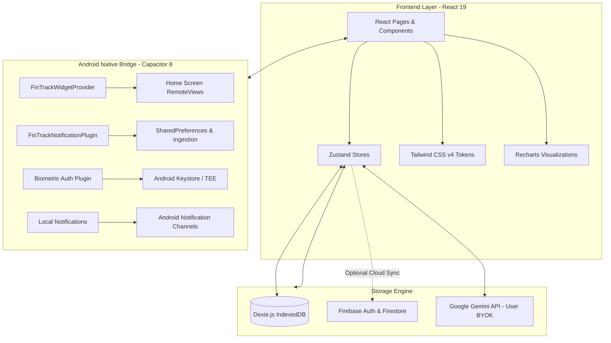

<div align="center">

# FinTrack

**A local-first personal finance application for Android with native home screen widgets, receipt scanning, and offline storage.**

[](https://github.com/Flynarch/finansial-tracker/releases/tag/v5.8.0)
[](https://github.com/Flynarch/finansial-tracker/releases/latest)
[](https://react.dev/)
[](https://vitejs.dev/)
[](https://tailwindcss.com/)
[](https://dexie.org/)
[](LICENSE)

*FinTrack is a personal finance tracker designed for mobile use on Android. All data is stored locally on the device using IndexedDB, allowing the app to run completely offline without mandatory accounts or remote servers. Cloud backup via Firebase and AI features via Google Gemini are optional.*

[Download APK](https://github.com/Flynarch/finansial-tracker/releases/latest) • [Features](#features) • [Architecture](#architecture) • [Getting Started](#getting-started) • [Building APK](#building-the-android-apk)

---

</div>

## Table of Contents

- [About FinTrack](#about-fintrack)
- [Features](#features)
  - [1. Android Home Screen Widgets](#1-android-home-screen-widgets)
  - [2. Dashboard & Net Worth Overview](#2-dashboard--net-worth-overview)
  - [3. Transactions & Data Entry](#3-transactions--data-entry)
  - [4. In-App Keypad & Calculator](#4-in-app-keypad--calculator)
  - [5. AI Features & Receipt Scanner (BYOK)](#5-ai-features--receipt-scanner-byok)
  - [6. Accounts & Multi-Currency](#6-accounts--multi-currency)
  - [7. Budgets & Spending Limits](#7-budgets--spending-limits)
  - [8. Savings Goals & Emergency Runway](#8-savings-goals--emergency-runway)
  - [9. Debts & Receivables (Hutang & Piutang)](#9-debts--receivables-hutang--piutang)
  - [10. Bill Splitting (Split Bill)](#10-bill-splitting-split-bill)
  - [11. Financial Reports & Export](#11-financial-reports--export)
  - [12. Calendar View](#12-calendar-view)
  - [13. Financial Habits & Task Checklist](#13-financial-habits--task-checklist)
  - [14. Privacy, Security & Offline Storage](#14-privacy-security--offline-storage)
  - [15. Language & Themes](#15-language--themes)
- [Architecture](#architecture)
- [Tech Stack](#tech-stack)
- [Getting Started](#getting-started)
  - [Prerequisites](#prerequisites)
  - [Installation](#installation)
  - [Environment Variables](#environment-variables)
  - [Running Locally](#running-locally)
- [Building the Android APK](#building-the-android-apk)
- [Testing & Quality Verification](#testing--quality-verification)
- [Project Structure](#project-structure)
- [License](#license)

---

## About FinTrack

FinTrack is an offline-first mobile financial management application built with React 19, Tailwind CSS v4, and Capacitor 8 for Android.

The app stores accounts, transactions, debts, savings, and budgets locally in IndexedDB using Dexie.js. It does not require user registration, contains no third-party trackers or ads, and functions fully without internet connectivity.

---

## Features

### 1. Android Home Screen Widgets
- **Adaptive Layouts**: Supports Small (2x2), Medium (4x2), and Large (4x3+) widget sizes on Android 12+.
  - **Small (2x2)**: Displays current total balance, active period, and a quick-add button.
  - **Medium (4x2)**: Displays current balance alongside a breakdown of income, expense, and net surplus/deficit.
  - **Large (4x3+)**: Adds a cash flow trend curve rendered directly on the widget canvas.
- **Privacy Mode**: Option to mask balance figures into `Rp ••••••` directly on the widget.
- **Direct Quick Add**: Tap the `+` button on the widget to open the transaction entry screen via deep link (`fintrack://quick-add`).
- **Widget Configuration**: Set calculation period (7 days, 30 days, or current month) and filter specific accounts per widget.

### 2. Dashboard & Net Worth Overview
- **Net Worth Calculation**: Aggregates balances across cash, bank accounts, e-wallets, investments, and loan positions.
- **Trend Charts**: Interactive historical balance charts with selectable ranges (1 day, 1 week, 1 month, 3 months, 1 year, or all time).
- **Wallet Carousel**: Horizontal carousel showing individual account cards with financial institution logos and smooth balance masking animations.
- **Quick Metric Cards**: Summary of total income, expenses, and net cash flow for the selected period.

### 3. Transactions & Data Entry
- **Two-Tier Categories**: Organize transactions into primary categories and subcategories with custom icons and color tags.
- **Split Transactions**: Allocate a single transaction across multiple expense categories, with the ability to exclude specific items from overall analytics.
- **Recurring Transactions**: Schedule automatic recurring entries (daily, weekly, monthly, yearly) for subscriptions or regular income.
- **Custom Tags & Notes**: Multi-line note field and tag support for detailed categorization.
- **Transaction Filters & Search**: Filter transactions by date range, account, category, type, and keyword search.
- **Bank Notification Ingestion**: Optional Android notification listener that detects incoming financial notifications (BCA, Mandiri, BRI, BNI, Jago, GoPay, OVO, Dana) for quick review and one-tap recording.

### 4. In-App Keypad & Calculator
- **Dedicated Numeric Keypad**: Replaces the native mobile software keyboard during amount entry to prevent viewport shifting.
- **Built-in Calculator**: Supports arithmetic operators (`+`, `−`, `×`, `÷`) with real-time preview of calculation results before applying.
- **Quick Multipliers**: Dedicated `000` button (or decimal separator for non-IDR currencies) and `k` button for thousand values.
- **Fast Input Controls**: Clear button (`C`) and backspace with long-press support for rapid corrections.

### 5. AI Features & Receipt Scanner (BYOK)
- **Bring Your Own Key (BYOK)**: FinTrack does not bundle shared or hardcoded API keys. Users can supply their own Google Gemini API key via the settings page.
- **Encrypted Local Key Storage**: User API keys are encrypted at rest using AES-GCM in local device storage and are automatically excluded from data exports.
- **Receipt OCR**: Extract merchant names, transaction dates, purchased items, tax, discounts, and totals from receipt photos using Gemini Vision models.
- **AI Financial Assistant**: Conversational assistant for budgeting guidance, transaction analysis, and financial inquiries.
- **Automated Merchant Categorization**: Matches new merchant names to appropriate expense categories based on pattern history and optional AI classification.

### 6. Accounts & Multi-Currency
- **Multiple Account Types**: Manage Cash, Bank Accounts, E-Wallets, and Investment Portfolios.
- **Internal Transfers**: Transfer funds between accounts without altering net income or expense totals.
- **Multi-Currency Support**: Record transactions in foreign currencies with cached exchange rates.
- **Manual Balance Reconciliation**: Adjust recorded balances to match physical accounts or statements.

### 7. Budgets & Spending Limits
- **Category Budgets**: Set monthly spending limits per expense category with visual progress indicators.
- **Custom Budget Cycles**: Align monthly budgeting cycles with your actual payday (e.g., starting on the 25th of each month).
- **Spending Alerts**: Visual warnings when category spending reaches 80% and 100% of the allocated budget.

### 8. Savings Goals & Emergency Runway
- **Goal Vaults**: Set financial targets with target amounts, target completion dates, and progress percentages.
- **Deposit & Withdrawal History**: Track individual contributions and withdrawals per goal vault.
- **Emergency Runway Calculator**: Estimates how many months your available savings can sustain current spending based on your average monthly expenses.

### 9. Debts & Receivables (Hutang & Piutang)
- **Dual Ledger**: Track liabilities (money you owe) and receivables (money owed to you).
- **Partial Payments**: Record installment payments with automatic remaining balance calculations.
- **Loan Forgiveness**: Option to forgive debts while preserving historical ledger accuracy.

### 10. Bill Splitting (Split Bill)
- **Flexible Splitting**: Split group bills evenly or calculate individual shares by item.
- **Tax & Service Charge Distribution**: Automatically distributes taxes, service fees, and discounts proportionally across participants.
- **Formatted Summary**: Generates a text summary formatted for sharing via messaging apps.

### 11. Financial Reports & Export
- **Income & Expense Statement**: Breakdown of revenue, expenses, net savings, and daily burn rates.
- **Balance Sheet**: Summary of assets, liabilities, and net equity.
- **PDF Export**: Generate formatted, printable PDF financial statements directly on the device.
- **CSV Export**: Export raw transaction records for analysis in external spreadsheet software.

### 12. Calendar View
- **Daily Financial Calendar**: View daily income, expense, and transaction count in monthly and weekly formats.
- **Date Detail Sheet**: Tap any date to inspect all transactions recorded on that day.

### 13. Financial Habits & Task Checklist
- **Consistency Heatmap**: Visual activity grid showing daily transaction logging discipline.
- **Financial Tasks (To-Do)**: Simple task list for pending bills, financial chores, and planning notes.

### 14. Privacy, Security & Offline Storage
- **Offline & Local-First**: Financial records reside inside the device's IndexedDB database using Dexie.js.
- **Biometric Authentication**: Fingerprint and facial recognition unlock via Android Keystore (`@aparajita/capacitor-biometric-auth`).
- **PIN & Pattern Lock**: In-app PIN or pattern lock fallback with configurable auto-lock duration.
- **Zero-Knowledge Backup**: Backup data locally to encrypted files protected with a 12-word recovery mnemonic phrase.
- **Optional Cloud Backup**: Optional backup to Firebase Firestore for users who want remote synchronization.
- **No Third-Party Trackers**: No third-party analytics SDKs, advertising libraries, or background telemetry.

### 15. Language & Themes
- **Bilingual Interface**: Full support for Indonesian (Bahasa Indonesia) and English.
- **Theme Options**: Light, Dark, and Midnight / AMOLED themes.

---

## Architecture



---

## Tech Stack

| Component | Library | Version | Description |
| :--- | :--- | :--- | :--- |
| **Framework** | React | 19.2.5 | UI components and application state |
| **Build Tool** | Vite | 6.0.1 | Development server and production bundling |
| **Styling** | Tailwind CSS | 4.2.4 | CSS tokens and responsive layout |
| **Mobile Bridge** | Capacitor | 8.4.1 | Native Android integration |
| **Local Storage** | Dexie.js | 4.4.2 | IndexedDB database layer |
| **State Management** | Zustand | 5.0.13 | Lightweight application state stores |
| **Charts** | Recharts | 3.9.2 | SVG charts for trends and cash flow |
| **Biometrics** | @aparajita/capacitor-biometric-auth | 10.0.0 | Fingerprint and biometric unlock |
| **Math Precision** | decimal.js-light | 2.5.1 | Precision arithmetic for currency calculations |
| **Date Handling** | date-fns | 4.1.0 | Date formatting and period calculations |
| **PDF Generation** | jsPDF | 4.2.1 | Client-side statement PDF export |
| **Icons** | Lucide React | 1.25.0 | Vector UI icons |
| **Cloud (Optional)** | Firebase | 12.13.0 | Optional authenticated cloud backup |

---

## Getting Started

### Prerequisites
- **Node.js**: `v20.x` or higher
- **npm**: `v9.x` or higher
- **Android Studio** & **Java JDK 17 / 21** (only required when building the native Android APK)

### Installation

1. Clone the repository:
   ```bash
   git clone https://github.com/Flynarch/finansial-tracker.git
   cd finansial-tracker
   ```

2. Install dependencies:
   ```bash
   npm install
   ```

### Environment Variables

Environment variables are optional. If you want to use local environment defaults during development, create a `.env` file in the root directory:

```env
# Google Gemini (Optional local fallback for receipt scanning and chat)
VITE_GEMINI_API_KEY=your_gemini_api_key

# Optional Firebase configuration (for cloud backup)
VITE_FIREBASE_API_KEY=your_firebase_api_key
VITE_FIREBASE_AUTH_DOMAIN=your_project.firebaseapp.com
VITE_FIREBASE_PROJECT_ID=your_project_id
VITE_FIREBASE_STORAGE_BUCKET=your_project.appspot.com
VITE_FIREBASE_MESSAGING_SENDER_ID=your_sender_id
VITE_FIREBASE_APP_ID=your_app_id
```

*Note: For production builds, users can enter their Gemini API key directly in the app settings under "Pengaturan > Integrasi AI".*

### Running Locally

Start the Vite development server:

```bash
npm run dev
```

Open your browser at `http://localhost:5173`.

To build the static web bundle:

```bash
npm run build
```

---

## Building the Android APK

1. Build production web assets and sync to the Android native folder:
   ```bash
   npm run build
   npx cap sync android
   ```

2. Compile the debug APK using Gradle:
   - **Windows**:
     ```powershell
     cmd.exe /c "cd android && gradlew.bat assembleDebug"
     ```
   - **Linux / macOS**:
     ```bash
     cd android && ./gradlew assembleDebug
     ```

The output file is generated at `android/app/build/outputs/apk/debug/app-debug.apk`.

---

## Testing & Quality Verification

Run the project verification checks:

```bash
# Run unit test suite (1090+ tests across 80 suites)
npm test

# Run linter
npm run lint

# Check for hardcoded or unlocalized UI strings
npm run lint:i18n

# Validate production build
npm run build

# Verify Android Java compilation
cmd.exe /c "cd android && gradlew.bat compileDebugJavaWithJavac"
```

---

## Project Structure

```
finansial-tracker/
├── android/                  # Native Android project (Capacitor)
│   └── app/src/main/
│       ├── java/com/fintrack/app/
│       │   ├── FinTrackWidgetProvider.java       # Home screen widget logic & canvas curve
│       │   ├── FinTrackWidgetConfigActivity.java # Widget configuration activity
│       │   ├── FinTrackNotificationPlugin.java   # SharedPreferences bridge
│       │   └── MainActivity.java                 # Android entry activity
│       └── res/
│           ├── layout/
│           │   ├── widget_fintrack_small.xml     # Small 2x2 widget layout
│           │   ├── widget_fintrack_medium.xml    # Medium 4x2 widget layout
│           │   ├── widget_fintrack_large.xml     # Large 4x3+ widget layout
│           │   └── activity_widget_config.xml    # Widget config layout
│           ├── values/                           # Light theme colors and strings
│           ├── values-night/                     # Dark theme colors
│           └── values-en/                        # English translations
├── src/
│   ├── components/           # UI components organized by domain
│   │   ├── budget/           # Budget limits, alerts, and split-bill dialogs
│   │   ├── chat/             # AI chat and receipt scanner views
│   │   ├── dashboard/        # Net worth cards, account carousel, and stat charts
│   │   ├── habits/           # Discipline heatmap and consistency tracker
│   │   ├── layout/           # AppShell, bottom navigation, and top bars
│   │   ├── loans/            # Loan ledgers, payment modals, and forgiveness
│   │   ├── reports/          # Financial statements and category breakdowns
│   │   ├── savings/          # Savings goals and vaults
│   │   ├── settings/         # Security, preferences, and backup options
│   │   ├── transactions/     # Transaction cards, virtual keypad, and filter drawers
│   │   └── ui/               # Reusable primitives (Buttons, Sheets, Modals)
│   ├── hooks/                # Custom React hooks (useDashboardData, useBackButton, etc.)
│   ├── lib/                  # Database, calculations, currency, and Gemini API helpers
│   ├── locales/              # Bilingual dictionaries (id.js, en.js)
│   ├── pages/                # Main router views (Dashboard, Transactions, Reports, etc.)
│   ├── store/                # Zustand global stores
│   ├── App.jsx               # Application root and route tree
│   ├── index.css             # Tailwind CSS tokens
│   └── main.jsx              # React bootstrap entry
├── tests/                    # Vitest unit test suites
├── capacitor.config.json     # Capacitor configuration
├── package.json              # Project dependencies and npm scripts
└── vite.config.js            # Vite bundler configuration
```

---

## License

This project is licensed under the [MIT License](LICENSE).
