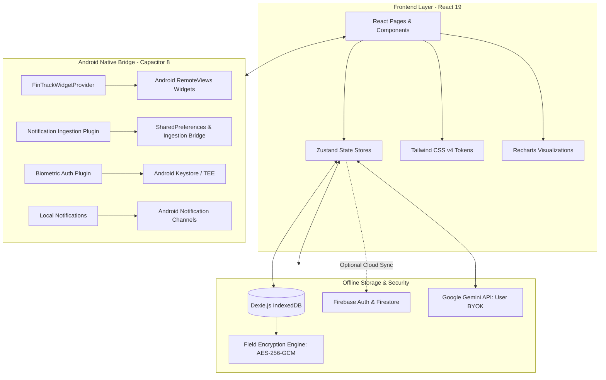

<div align="center">

# FinTrack

**A local-first personal finance application for Android with native home screen widgets, receipt scanning, and offline storage.**

[](https://github.com/Flynarch/finansial-tracker/releases/tag/v6.0.0)
[](https://github.com/Flynarch/finansial-tracker/releases/latest)
[-brightgreen.svg?style=flat-square)](https://github.com/Flynarch/finansial-tracker)
[](SECURITY.md)
[](https://react.dev/)
[](https://vitejs.dev/)
[](https://tailwindcss.com/)
[](https://dexie.org/)
[](LICENSE)

FinTrack gives you complete ownership over your personal finances. Built from the ground up for Android, all accounts, ledgers, and transactions live strictly on your device inside an encrypted offline database. No accounts required, no trackers, and zero forced cloud sync.

[Download Latest APK (v6.0.0)](https://github.com/Flynarch/finansial-tracker/releases/latest) • [Key Features](#key-features) • [Comparison](#why-fintrack) • [Architecture](#architecture) • [Getting Started](#getting-started) • [Security](SECURITY.md)

---

</div>

## Table of Contents

- [Why FinTrack?](#why-fintrack)
- [Key Features](#key-features)
  - [1. Frictionless Daily Tracking](#1-frictionless-daily-tracking)
  - [2. Android Native Integration](#2-android-native-integration)
  - [3. Deep Financial Intelligence & Reports](#3-deep-financial-intelligence--reports)
  - [4. Planning, Savings & Debt Management](#4-planning-savings--debt-management)
  - [5. Zero-Knowledge Privacy & Security](#5-zero-knowledge-privacy--security)
  - [6. Optional AI Powers (Bring Your Own Key)](#6-optional-ai-powers-bring-your-own-key)
- [Feature Comparison](#feature-comparison)
- [Architecture](#architecture)
- [Tech Stack](#tech-stack)
- [Getting Started](#getting-started)
  - [Prerequisites](#prerequisites)
  - [Installation & Local Run](#installation--local-run)
  - [Environment Variables](#environment-variables)
- [Building the Android APK](#building-the-android-apk)
- [Testing & Quality Verification](#testing--quality-verification)
- [Project Structure](#project-structure)
- [License](#license)

---

## Why FinTrack?

Most modern finance apps demand your phone number, upload your financial history to third-party cloud servers, and clutter your experience with advertisements or subscriptions.

FinTrack is built on three core principles:

1. **Complete Data Sovereignty (Local-First)**: Your financial data belongs exclusively to you. Every ledger transaction is stored locally using Dexie.js and IndexedDB on your device. The app operates with 100% functionality even in airplane mode.
2. **Native Mobile Ergonomics**: Designed specifically for Android. Features home screen adaptive widgets (2x2, 4x2, 4x3+), biometric fingerprint unlock, responsive haptic feedback, and a built-in numeric keypad that prevents Android keyboard layout shifts.
3. **Rigorous Double-Entry & Ledger Integrity**: Supports complex multi-item transaction splits, internal non-analytic transfers, partial debt repayments, and automatic currency normalization with verifiable accounting invariants.

---

## Key Features

### 1. Frictionless Daily Tracking
- **Built-in Keypad Calculator**: Enter transaction amounts with an in-app keypad featuring live arithmetic operators (`+`, `-`, `x`, `/`), quick multipliers (`000` / `k`), and instant previews before submission.
- **Two-Tier Category Hierarchy**: Categorize spending into primary categories and detailed subcategories, each equipped with customizable brand icons and color themes.
- **Multi-Category Split Transactions**: Divide a single receipt or bill across different categories with individual notes and per-item analytics toggles.
- **Automated Recurring Transactions**: Schedule recurring subscriptions, bills, or paychecks with automated interval stepping that safely handles leap years and month-end dates.
- **Bank Notification Ingestion**: Optional Android notification listener that detects SMS and bank notifications (BCA, Mandiri, BRI, BNI, Jago, GoPay, OVO, Dana) for one-tap review and approval.

### 2. Android Native Integration
- **Adaptive Home Screen Widgets**:
  - **Compact (2x2)**: Total net balance, current period label, and quick transaction launch button.
  - **Standard (4x2)**: Net balance alongside real-time income, expense, and surplus/deficit metrics.
  - **Expanded (4x3+)**: Adds an interactive canvas cash flow curve rendered natively via Android RemoteViews.
  - **Privacy Mode**: Tap to mask sensitive balance figures into masked dots directly on the home screen.
- **Deep Links & Quick Actions**: Tap the widget plus icon to instantly trigger transaction entry via `fintrack://quick-add`.
- **Hardware Back Button Handling**: Native Android back gesture closes active bottom sheets, modals, and date pickers in orderly sequence before navigating back.

### 3. Deep Financial Intelligence & Reports
- **Net Worth & Asset Aggregation**: Live calculation combining liquid cash, bank balances, e-wallets, investment portfolios, and net debt positions.
- **Comprehensive Financial Statements**: Generate detailed Income Statements, Expense Breakdowns, and Balance Sheets on demand.
- **Client-Side PDF & CSV Export**: Export publication-grade PDF statements and raw CSV data directly in the browser runtime without sending data to an external server.
- **Financial Calendar & Consistency Heatmap**: Track daily transaction counts, review daily income/expense summaries, and build consistent logging habits via an activity heatmap.

### 4. Planning, Savings & Debt Management
- **Payday-Aligned Budget Cycles**: Configure custom monthly budgeting start dates (e.g. Starting every 25th) to match your real-world income cycle.
- **Savings Vaults & Emergency Runway**: Allocate money toward specific targets with visual progress rings. Includes an automated Emergency Runway calculator that estimates how many months your savings can cover based on real average burn rates.
- **Dual Debt & Receivable Ledger (Hutang-Piutang)**: Manage both liabilities (debts you owe) and receivables (loans granted to others), complete with installment schedules and debt forgiveness support.
- **Bill Splitting (Split Bill)**: Calculate fair group expenses evenly or item-by-item, with proportional distribution of taxes, service fees, and discounts.

### 5. Zero-Knowledge Privacy & Security
- **Biometric Security**: Unlock using device fingerprint or facial recognition backed by Android Keystore and Hardware Security Modules.
- **Field-Level AES-256-GCM Encryption**: Transaction notes and sensitive details are encrypted at rest using PBKDF2 key derivation and AES-GCM.
- **Encrypted Local Backup**: Export complete database backups secured by a 12-word mnemonic recovery phrase.
- **Zero Third-Party Trackers**: No third-party tracking scripts, analytics SDKs, or background telemetries.

### 6. Optional AI Powers (Bring Your Own Key)
- **Zero Lock-In (BYOK)**: FinTrack never requires a paid subscription. You can enter your personal Google Gemini API key to unlock AI features.
- **Receipt OCR & Item Extraction**: Scan physical paper receipts with your camera; Gemini Vision extracts merchant names, individual item prices, dates, taxes, and suggested categories automatically.
- **Conversational Finance Assistant**: Natural language financial assistant to answer questions about your monthly spending trends and budget health.
- **Secure Key Storage**: API keys are encrypted locally using AES-GCM and excluded from all exports.

---

## Feature Comparison

| Feature | FinTrack | Standard Cloud Finance Apps | Simple Spreadsheet |
| :--- | :--- | :--- | :--- |
| **Data Storage** | Local Device (IndexedDB) | Remote Cloud Server | Cloud Drive or File |
| **Offline Reliability** | 100% Fully Functional | Often Blocked / Degraded | Limited Mobile UX |
| **Mandatory Sign-Up** | None (Zero Login Required) | Required (Email/Phone) | Requires Account |
| **Home Screen Widgets** | Native Android (2x2, 4x2, 4x3+) | Rare or Read-Only | None |
| **Note Encryption** | AES-256-GCM at rest | Plaintext on Server | Plaintext |
| **In-App Calculator** | Built-in Numeric Keypad | Basic OS Keyboard | Formula typing |
| **Receipt OCR** | Optional (Personal Gemini Key) | Paid Subscription | Manual Entry |
| **Advertisements / Trackers**| Zero Ads, Zero Trackers | Common Advertisements | None |

---

## Architecture



---

## Tech Stack

| Component | Technology | Version | Description |
| :--- | :--- | :--- | :--- |
| **UI Framework** | React | 19.2.5 | Component-driven declarative UI |
| **Bundler & Tooling**| Vite | 8.0.10 | High-speed development server and production bundler |
| **Styling** | Tailwind CSS | 4.2.4 | Design system tokens and adaptive layouts |
| **Native Runtime** | Capacitor | 8.4.1 | Android native bridge and plugin ecosystem |
| **Local Database** | Dexie.js | 4.4.2 | IndexedDB wrapper with reactive queries (`useLiveQuery`) |
| **State Management** | Zustand | 5.0.13 | High-performance decoupled client state stores |
| **Visual Charts** | Recharts | 3.9.2 | Responsive SVG chart visualizations |
| **Biometric Auth** | @aparajita/capacitor-biometric-auth | 10.0.0 | Android Keystore fingerprint and biometric unlock |
| **Math Precision** | decimal.js-light | 2.5.1 | Arbitrary precision arithmetic preventing floating point drift |
| **Date Management** | date-fns | 4.1.0 | Immutable date math and localization |
| **PDF Generation** | jsPDF | 4.2.1 | In-memory client-side PDF document generation |
| **Icons** | Lucide React | 1.25.0 | Clean, accessible SVG iconography |

---

## Getting Started

### Prerequisites
- **Node.js**: `v20.x` or higher
- **npm**: `v9.x` or higher
- **Android Studio** & **Java JDK 17 / 21** (only required if building the native APK from source)

### Installation & Local Run

1. Clone the repository:
   ```bash
   git clone https://github.com/Flynarch/finansial-tracker.git
   cd finansial-tracker
   ```

2. Install dependencies:
   ```bash
   npm install
   ```

3. Start the local development server:
   ```bash
   npm run dev
   ```

Open your browser at `http://localhost:5173`.

### Environment Variables

Environment variables are entirely optional. If you wish to set development defaults, create a `.env` file in the project root:

```env
# Optional Google Gemini fallback for development
VITE_GEMINI_API_KEY=your_gemini_api_key

# Optional Firebase configuration for testing cloud backup
VITE_FIREBASE_API_KEY=your_firebase_api_key
VITE_FIREBASE_AUTH_DOMAIN=your_project.firebaseapp.com
VITE_FIREBASE_PROJECT_ID=your_project_id
VITE_FIREBASE_STORAGE_BUCKET=your_project.appspot.com
VITE_FIREBASE_MESSAGING_SENDER_ID=your_sender_id
VITE_FIREBASE_APP_ID=your_app_id
```

---

## Building the Android APK

1. Build production web assets and sync to the native Android directory:
   ```bash
   npm run build
   npx cap sync android
   ```

2. Assemble the Android APK with Gradle:
   - **Windows PowerShell / CMD**:
     ```powershell
     cmd.exe /c "cd android && gradlew.bat assembleDebug"
     ```
   - **Linux / macOS**:
     ```bash
     cd android && ./gradlew assembleDebug
     ```

The compiled binary will be generated at `android/app/build/outputs/apk/debug/app-debug.apk`.

---

## Testing & Quality Verification

FinTrack enforces strict verification standards across all code changes:

```bash
# Run unit and regression test suite (1,748+ tests across 120 suites)
npm test

# Run ESLint validation
npm run lint

# Audit for unlocalized or hardcoded UI strings
npm run lint:i18n

# Validate production build bundle
npm run build

# Verify Android Java compilation
cmd.exe /c "cd android && gradlew.bat compileDebugJavaWithJavac"
```

---

## Project Structure

```
finansial-tracker/
├── android/                  # Native Android Capacitor project
│   └── app/src/main/
│       ├── java/com/fintrack/app/
│       │   ├── FinTrackWidgetProvider.java       # Home screen widget logic & canvas rendering
│       │   ├── FinTrackWidgetConfigActivity.java # Widget configuration activity
│       │   ├── FinTrackNotificationPlugin.java   # Native notification ingestion bridge
│       │   └── MainActivity.java                 # Android entry activity
│       └── res/                                  # Widget XML layouts, drawables, and themes
├── src/
│   ├── components/           # Domain-driven UI components
│   │   ├── budget/           # Budget cycle limits, warnings, and alerts
│   │   ├── chat/             # AI finance chat and receipt OCR views
│   │   ├── dashboard/        # Net worth cards, account carousel, and stat charts
│   │   ├── habits/           # Discipline heatmaps and habit trackers
│   │   ├── layout/           # AppShell, bottom navigation, and mobile header
│   │   ├── loans/            # Debt and receivable ledgers (Hutang-Piutang)
│   │   ├── reports/          # Financial statements and category breakdowns
│   │   ├── savings/          # Savings goal vaults and emergency runway
│   │   ├── settings/         # Security preferences, biometrics, and backups
│   │   ├── split-bill/       # Multi-participant bill splitting dialogs
│   │   ├── transactions/     # Transaction cards, custom keypad, and filter drawers
│   │   └── ui/               # Reusable primitives (Buttons, Sheets, Modals)
│   ├── hooks/                # Custom React hooks (useDashboardData, useBackButton, etc.)
│   ├── lib/                  # Offline database, encryption, currency, and AI services
│   ├── locales/              # Bilingual dictionaries (id.js, en.js)
│   ├── pages/                # Main router views (Dashboard, Transactions, Reports, etc.)
│   ├── store/                # Zustand application stores
│   ├── App.jsx               # Application root and route configuration
│   ├── index.css             # Tailwind CSS tokens and base styles
│   └── main.jsx              # React bootstrap entry
├── tests/                    # Vitest unit and integration test suites
├── capacitor.config.json     # Capacitor configuration
├── package.json              # Project dependencies and npm scripts
└── vite.config.js            # Vite bundler configuration
```

---

## License

This project is open-source and licensed under the [MIT License](LICENSE).
