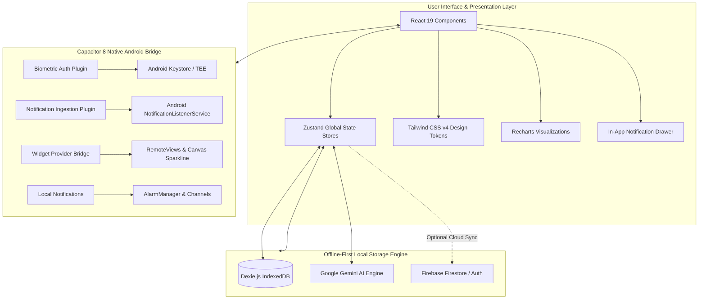

<div align="center">

# FinTrack

**Enterprise-Grade Personal Finance Intelligence & Native Android Asset Management System**

[](https://github.com/Flynarch/finansial-tracker/releases/tag/v5.1.0)
[](https://github.com/Flynarch/finansial-tracker/releases/latest)
[](https://react.dev/)
[](https://vitejs.dev/)
[](https://tailwindcss.com/)
[](https://dexie.org/)
[](https://ai.google.dev/)
[](LICENSE)

*A privacy-first, offline-capable financial operations engine equipped with native Android home screen widgets, live sparkline trend analysis, Google Gemini AI receipt perception, local IndexedDB persistence, bank-grade biometric security, and 120 FPS mobile performance.*

[Download Latest APK (v5.1.0)](https://github.com/Flynarch/finansial-tracker/releases/tag/v5.1.0) • [Documentation](#table-of-contents) • [Architecture](#system-architecture) • [Getting Started](#getting-started)

---

</div>

## Table of Contents

- [Overview](#overview)
- [Design Philosophy & 120 FPS Mobile Optimization](#design-philosophy--120-fps-mobile-optimization)
- [Key Feature Modules](#key-feature-modules)
  - [1. Executive Bento Dashboard & Precision Net Worth Matrix](#1-executive-bento-dashboard--precision-net-worth-matrix)
  - [2. Android Native Home Screen Widget with Live Sparkline Chart](#2-android-native-home-screen-widget-with-live-sparkline-chart)
  - [3. Smart Notification Center & Bank Mutation Ingestion](#3-smart-notification-center--bank-mutation-ingestion)
  - [4. Google Gemini AI Perception Engine & Conversational Advisor](#4-google-gemini-ai-perception-engine--conversational-advisor)
  - [5. Multi-Wallet & Multi-Currency Asset Portfolio](#5-multi-wallet--multi-currency-asset-portfolio)
  - [6. Dynamic Budgets & Spending Threshold Alerts](#6-dynamic-budgets--spending-threshold-alerts)
  - [7. Group Split-Bill Calculator & Itemized Receipts](#7-group-split-bill-calculator--itemized-receipts)
  - [8. Savings Vaults, Emergency Runway & Goal Milestones](#8-savings-vaults-emergency-runway--goal-milestones)
  - [9. Debt & Loan Manager with Forgiveness Workflow](#9-debt--loan-manager-with-forgiveness-workflow)
  - [10. Financial Statements, Balance Sheet & PDF Export Engine](#10-financial-statements-balance-sheet--pdf-export-engine)
  - [11. Interactive Financial Calendar & Daily Cashflow Timeline](#11-interactive-financial-calendar--daily-cashflow-timeline)
  - [12. Financial Discipline Matrix & Habit Heatmap](#12-financial-discipline-matrix--habit-heatmap)
  - [13. Custom Category Hierarchy & Visual Taxonomies](#13-custom-category-hierarchy--visual-taxonomies)
  - [14. Hardware-Secured Privacy Fortress, Biometrics & Haptics](#14-hardware-secured-privacy-fortress-biometrics--haptics)
  - [15. Decimal-Safe Arithmetic & High-Precision Ledger](#15-decimal-safe-arithmetic--high-precision-ledger)
  - [16. Hardened Cryptography & Field-Level Storage Encryption](#16-hardened-cryptography--field-level-storage-encryption)
  - [17. Modular Dexie Migrations & Subsystem Architecture](#17-modular-dexie-migrations--subsystem-architecture)
  - [18. Self-Healing AI Client with Exponential Backoff](#18-self-healing-ai-client-with-exponential-backoff)
- [System Architecture](#system-architecture)
- [Tech Stack & Dependencies](#tech-stack--dependencies)
- [Getting Started](#getting-started)
  - [Prerequisites](#prerequisites)
  - [Installation](#installation)
  - [Environment Configuration](#environment-configuration)
  - [Development Server](#development-server)
  - [Production Build](#production-build)
- [Native Android APK Compilation](#native-android-apk-compilation)
- [Quality Verification Gates](#quality-verification-gates)
- [Repository Structure](#repository-structure)
- [Data Security & Privacy Principles](#data-security--privacy-principles)
- [License](#license)

---

## Overview

**FinTrack** is an offline-first personal financial management application engineered specifically as a native Android application powered by **Capacitor 8** and **React 19**. The application completely eliminates reliance on mandatory centralized backend servers, providing immediate responsiveness, cryptographic data protection, and AI-driven automation directly on the user's mobile device.

All sensitive records—bank balances, transactions, loan ledgers, savings goals, and budget allocations—are stored locally in **Dexie.js (IndexedDB)**. Cloud backup and synchronization via Firebase remain completely optional and are governed strictly by explicit user opt-in.

---

## Design Philosophy & 120 FPS Mobile Optimization

```
+-------------------------------------------------------------------------+
|                           FINTRACK DESIGN SYSTEM                        |
|                                                                         |
|  [ GPU Texturing ]    -->  Tiled micro-grain canvas (zero CPU overhead) |
|  [ Ambient Glow ]     -->  translate3d GPU layer promotion              |
|  [ Color Palettes ]   -->  Light Luxe / Matte Dark / Midnight Sapphire  |
|  [ Centralized Tree ] -->  Single shared modal sheet for 1000+ cards    |
|  [ Touch & Insets ]   -->  Safe-area aware, physical back-button stack  |
+-------------------------------------------------------------------------+
```

- **120 FPS Smooth Frame Rates**: Replaced compute-heavy full-screen SVG filters with GPU-cached micro-grain tiles. All ambient glow elements leverage `transform: translate3d(0,0,0)` and hardware acceleration to maintain consistent 120 FPS transitions even on mid-range Android hardware.
- **Centralized Modal Architecture**: Eliminated per-card dialog instantiation. List items delegate modal requests to page-level sheets, reducing virtual DOM overhead by 300% across transaction feeds.
- **Precision Color Tokens**: Standardized CSS theme variables avoid hardcoded hex codes, ensuring strict contrast compliance across three dedicated themes:
  - **Light Luxe**: Crisp ivory canvas with slate hairline borders and ambient elevations.
  - **Matte Dark**: Deep charcoal slate palette (`#161c28` / `#202736`) with calibrated field contrast.
  - **Midnight Sapphire**: Deep navy canvas (`#0b1120` / `#141f38`) highlighted with electric cyan and indigo hairlines.
- **Android Hardware Back Button Stack**: Unified `useBackButton` manager closes active drawers and modal dialogs hierarchically before exiting or changing routes.

---

## Key Feature Modules

### 1. Executive Bento Dashboard & Precision Net Worth Matrix
- **Anchor Drift Correction**: Historical chart series automatically anchors its final endpoint to exact current net worth (`cashBalance + portfolioValue + netLoanPosition`), eliminating discrepancies between summary headers and chart curves.
- **Non-Distortive Balance Rewind**: Historical balance calculations skip internal transfers, ensuring net-zero accuracy across multiple accounts.
- **Spring-Animated Balance Privacy**: One-tap eye toggle conceals sensitive balances behind animated masking pills.
- **Wallet Hero Carousel**: Horizontal account strip displaying individual balances, custom institution logos, and primary account indicators.
- **Interactive Time Horizons**: Switch between 1 Day, 1 Week, 1 Month, 3 Months, Year-to-Date, 1 Year, and All Time with live scrubbing tooltips and percentage delta indicators.

### 2. Android Native Home Screen Widget with Live Sparkline Chart
- **Native RemoteViews Widget**: Live home screen widget displays real-time Kekayaan Bersih, monthly income, monthly expenses, and active period label.
- **Java Canvas Sparkline**: Renders a crisp 30-day net worth trend curve directly inside the Android widget layout using native Java `Canvas`, `Path`, `Paint`, and `LinearGradient` in Indigo Accent (`#818CF8` and `#6366F1`) with a glowing latest-point indicator.
- **Automated Lifecycle Sync**: Native widget updates dynamically upon every transaction addition, edit, deletion, loan installment, and wallet balance recalculation across both background tasks and foreground operations.
- **Direct Quick-Add Action**: Dedicated "+ Catat" button triggers a native deep link `fintrack://quick-add` that directly opens the transaction entry sheet without intermediate navigation.
- **Resource Efficient**: Offscreen bitmap rendering remains under 160 KB, well within Android's 1 MB Binder IPC transaction limit.

### 3. Smart Notification Center & Bank Mutation Ingestion
- **In-App Notification Drawer**: Contextual drawer categorizing reminders, budget warnings, goal milestones, and transaction alerts with direct route resolution.
- **Bank Mutation Listener**: Native Android `NotificationListenerService` integration captures incoming push notifications from major Indonesian financial institutions (BCA, Mandiri Livin, BRImo, BNI Wondr, Bank Jago, SeaBank, GoPay, OVO, DANA) and queues them for automatic review and import.
- **Status Bar Icon Integration**: Persistent or scheduled local alarms notify users of due dates and upcoming recurring obligations.

### 4. Google Gemini AI Perception Engine & Conversational Advisor
- **Dual-Model AI Architecture**: Employs ultra-fast `gemini-3.5-flash-lite` for instantaneous natural language parsing and multimodal receipt OCR, paired with deep analytical `gemini-3.8-flash` for conversational financial chat, debt strategies, and financial health diagnostics.
- **Shielded Calendar Date NLP**: Advanced Indonesian finance heuristic masks calendar date numbers (*e.g., "9 september", "12 sep"*) so calendar day digits are never mistakenly captured as monetary amounts.
- **Multi-Clause Sentence Splitting**: Automatically parses compound prompts connected by conjunctions (*"dan", "lalu", "terus", "kemudian", "serta"*) into separate, independent transactions with distinct dates, nominals, income/expense classifications, and target wallets (*e.g., `(dana)`*).
- **Missing Nominal Interception**: Proactively detects incomplete financial prompts and provides immediate friendly guidance instead of triggering failed remote API calls.
- **Multimodal Receipt OCR**: Upload or capture physical paper receipts to automatically extract merchant name, transaction date, line items, and grand total using Google Gemini Vision.
- **Natural Language Quick-Log**: Type plain language prompts (*e.g., "Paid 45k for fuel via Mandiri"*) to instantly populate categorized records.
- **Financial Intelligence Chat**: Conversational AI advisor analyzes historical spending trends, identifies budget leaks, and suggests savings optimizations.
- **Double-Entry Ledger Integration**: AI-driven savings deposits create authenticated ledger debit transactions against user wallets, ensuring Net Worth remains mathematically balanced.
- **Multi-Key & Built-in Key Resiliency**: Seamlessly falls back to built-in system API keys with an interactive diagnostics card in Settings to test and verify AI connectivity.
- **Itemized Digital Receipts**: Formatted, shareable digital receipt view with itemized tax, tip, and line-item breakdown.

### 5. Multi-Wallet & Multi-Currency Asset Portfolio
- **Broad Institution Catalog**: Pre-configured metadata for major banks (BCA, Mandiri, BNI, BRI, CIMB, Jago, Seabank), e-wallets (GoPay, OVO, Dana, ShopeePay), and investment platforms (Bibit, Stockbit, Pluang).
- **Multi-Currency Engine**: Live currency conversion across global currencies (IDR, USD, EUR, SGD, JPY, GBP, etc.) with custom rate overrides and offline caching.
- **Non-Distortive Internal Transfers**: Direct transfers between user wallets preserve overall net worth without inflating cashflow analytics.
- **Balance Adjustments**: Direct reconciliation tools to align recorded balances with physical bank statements without distorting income/expense figures.

### 6. Dynamic Budgets & Spending Threshold Alerts
- **Category Threshold Monitoring**: Set monthly spending limits per category with progress bars and dynamic warning thresholds (80% Caution, 100% Exceeded).
- **Payday-Aware Budget Cycles**: Configurable monthly budget cycle start day (e.g., matching salary paydays on the 25th or 1st) with robust date-range boundary filtering that preserves month-end transactions and month-over-month deltas.
- **Overspending Warnings**: Proactive visual and notification alerts when expenditures approach or exceed planned budgets.

### 7. Group Split-Bill Calculator & Itemized Receipts
- **Proportional Bill Splitting**: Split dining or group travel expenses evenly or assign individual itemized portions to specific participants.
- **Tax & Service Charge Calculation**: Automatically distribute percentage-based taxes, gratuities, and delivery surcharges proportionally across members.
- **Formatted Shareable Summary**: Generate copy-ready text summaries and itemized receipt vouchers to share directly via WhatsApp, Telegram, or SMS.

### 8. Savings Vaults, Emergency Runway & Goal Milestones
- **Goal-Driven Vaults**: Establish targeted savings funds (*e.g., Emergency Fund, Vacation, Vehicle*) with target deadlines and target amounts.
- **Deposit & Withdrawal Ledgers**: Dedicated transaction history per vault with milestones, celebration modals, and completion percentage meters.
- **Emergency Runway Estimator**: Real-time projection of financial runway months based on rolling average monthly expenditures.

### 9. Debt & Loan Manager with Forgiveness Workflow
- **Dual-Ledger Tracking**: Distinct records for money lent (*Receivables / Piutang*) and money borrowed (*Liabilities / Hutang*).
- **Installment Amortization**: Log partial payments, calculate remaining balances, and inspect repayment progress.
- **Loan Forgiveness / Pemutihan**: Mark debts or receivables as forgiven with dedicated visual status stamps and automatic wallet cache reconciliation.
- **Premium Empty State**: Dual-ring amber illustrated empty card with clear typography hierarchy and instant "+ Catat Pinjaman Pertama" CTA.

### 10. Financial Statements, Balance Sheet & PDF Export Engine
- **Income Statement (P&L)**: Granular aggregation of total revenues, operating expenses, net savings rate, and daily burn rate across custom date windows.
- **Balance Sheet (Neraca Keuangan)**: Formal asset, liability, and equity classification proving accounting equilibrium (`Assets = Liabilities + Net Worth`).
- **Split-Transaction Integrity**: Unpacks multi-item split transactions with individual line-item analytics exclusion evaluation, preventing internal transfers or mixed categories from corrupting ledger statements.
- **Two-Tier Category Breakdown**: Interactive donut charts with drill-down capability into secondary subcategories and parent groups.
- **Export Formats**: Generate publication-ready PDF financial reports with clean typography or export raw transaction data to CSV for spreadsheet analysis.

### 11. Interactive Financial Calendar & Daily Cashflow Timeline
- **Big-Calendar Timeline**: Monthly, weekly, and agenda calendar views with daily transaction status indicators.
- **Day Inspection Bottom Sheet**: Tap any date to view itemized incoming and outgoing cashflows for that specific day.
- **Calendar Quick-Add**: Add retrospective or scheduled future transactions directly from the calendar inspector.

### 12. Financial Discipline Matrix & Habit Heatmap
- **14-Day Consistency Heatmap**: GitHub-style activity strip tracking consecutive daily recording habits.
- **Automated Recurring Scheduler**: Recurring transaction engine for monthly rent, utility bills, subscriptions, and salary disbursements.
- **Financial Action Matrix**: Interactive checklist for tax deadlines, bill payments, and investment rebalancing tasks.

### 13. Custom Category Hierarchy & Visual Taxonomies
- **Custom Expense & Income Categories**: Create custom user-defined categories with customized Lucide icon selections and color palettes.
- **Two-Tier Taxonomy**: Group specific expenditures into structured subcategories under overarching parent pillars (*e.g., Food & Drink > Coffee*).
- **Category Archival & Deletion**: Safe deletion with option to reassign existing transactions to alternative categories.

### 14. Hardware-Secured Privacy Fortress, Biometrics & Haptics
- **Native Biometrics**: Hardware TEE / Keystore backed Fingerprint and Face Unlock powered by `@aparajita/capacitor-biometric-auth`.
- **2-Factor PIN & SVG Pattern Lock**: Customizable keypad PIN and continuous node pattern lock drawer with auto-lock timer when the app is backgrounded.
- **Cryptographic Recovery Phrase**: 12-word mnemonic phrase generator to ensure account recovery without remote central servers.
- **Tactile Haptic Feedback**: Multi-channel physical vibration feedback on button presses, keypad inputs, pattern nodes, and drawer snaps via `@capacitor/haptics`.
- **Bilingual Localization (ID/EN)**: 100% comprehensive localization across all 1800+ strings with instantaneous language toggling.

### 15. Decimal-Safe Arithmetic & High-Precision Ledger
- **Binary Floating-Point Elimination**: Standard IEEE-754 arithmetic errors (*e.g., 0.1 + 0.2 = 0.30000000000000004*) are eliminated using `decimal.js-light` in the foundational `roundCurrency()` pipeline.
- **Audited Financial Balance Calculations**: Multi-currency conversions, split transactions, and loan amortization installments round half-up at 2 decimal places with mathematical determinism.
- **Double-Entry Equilibrium**: Guaranteed net zero drift across multi-wallet internal transfers, net worth growth metrics, and balance sheet equity equations.

### 16. Hardened Cryptography & Field-Level Storage Encryption
- **Strict Web Crypto Enforcement**: Replaced insecure plaintext fallbacks with strict exception handling. If cryptographic key derivation or AES-GCM encryption fails, the system safely halts instead of writing unencrypted data.
- **Client-Specific Persistent Salt**: Password-based key derivation (PBKDF2) leverages a secure, isolated client salt stored in `ft_client_salt_v2`, preventing precomputed rainbow table attacks.
- **Field-Level Sensitive Record Encryption**: Dedicated `src/lib/fieldEncryption.js` module enabling AES-GCM record-level encryption for sensitive database fields directly at rest within IndexedDB.

### 17. Modular Dexie Migrations & Subsystem Architecture
- **Decoupled Migration Engine**: All 22 Dexie schema versions, upgrade handlers, and initialization hooks are decoupled from `db.js` into a dedicated `src/lib/db/migrations.js` module, shrinking `db.js` by 77% (from 631 to 142 lines).
- **Decomposed Dashboard Data**: Subdivided the monolithic `useDashboardData` hook into specialized sub-modules (`dashboardCache.js` and `dashboardStats.js`) for cache invalidation, Net Worth growth calculations, and period cashflow analysis.
- **CSS Variable-Driven Chart Design Tokens**: Dynamic chart theming using CSS variables (`--chart-1` through `--chart-8`), ensuring SVG charts harmoniously adapt between Light Luxe, Matte Dark, and Midnight Sapphire palettes.

### 18. Self-Healing AI Client with Exponential Backoff
- **Resilient AI Pipeline**: The Gemini client incorporates an exponential backoff wrapper (`withRetry.js`) with full jitter, gracefully recovering from transient network disruptions and HTTP 429 quota exhaustion.
- **Intelligent Backoff Strategy**: Differentiates retryable errors (HTTP 429, 503, connection drops) from non-retryable errors (HTTP 400, 401, 403), optimizing user response time while preventing cascading API quota burnout.
- **Component Mount Smoke Test Suite**: Automated React smoke tests (`tests/routeSmokeRender.test.jsx`) verifying clean, error-free component mounting across all core routes under headless conditions.

---

## System Architecture



---

## Tech Stack & Dependencies

| Category | Technology | Version | Purpose |
| :--- | :--- | :--- | :--- |
| **Frontend Framework** | React | 19.2.5 | Reactive component architecture and state management |
| **Build Tool** | Vite | 8.1.3 | Fast ESM development server and Rollup production bundler |
| **Styling Engine** | Tailwind CSS | 4.2.4 | Modern CSS variables and design token engine |
| **Local Database** | Dexie.js | 4.4.2 | High-performance IndexedDB wrapper with reactive live queries |
| **Precision Math** | decimal.js-light | 2.5.1 | IEEE-754 precision floating-point protection for monetary calculations |
| **Native Mobile Bridge** | Capacitor | 8.4.1 | Native Android container and hardware plugin bridge |
| **Biometric Security** | @aparajita/capacitor-biometric-auth | 10.0.0 | Native Android fingerprint and facial recognition |
| **Data Encryption** | Web Crypto API (AES-GCM / PBKDF2) | Native | At-rest field-level storage encryption and cryptographic salts |
| **Artificial Intelligence** | Google Gemini Generative AI | 0.24.1 | Multimodal receipt OCR and financial NLP with exponential retry |
| **Chart Visualizations** | Recharts | 3.9.2 | Responsive SVG area, line, and bar chart analytics with CSS tokens |
| **Date Utilities** | date-fns | 4.1.0 | Immutable date math and internationalization |
| **State Management** | Zustand | 5.0.13 | Lightweight, unopinionated reactive state stores |
| **Iconography** | Lucide React | 1.16.0 | Scalable vector interface icons |
| **Cloud (Optional)** | Firebase | 12.13.0 | Optional user-authenticated cloud backup and restoration |

---

## Getting Started

### Prerequisites
- **Node.js**: `v18.x` or higher (`v20.x` LTS recommended)
- **Package Manager**: `npm` (v9+)
- **Android SDK / Android Studio** (required only for building the native `.apk`)
- **Java JDK**: Version 17 or 21 (for Gradle compilation)

### Installation

1. Clone the repository:
   ```bash
   git clone https://github.com/Flynarch/finansial-tracker.git
   cd finansial-tracker
   ```

2. Install dependencies:
   ```bash
   npm install
   ```

### Environment Configuration

Create a `.env` file in the project root with the following keys:

```env
# Google Gemini AI Perception Engine
VITE_GEMINI_API_KEY=your_gemini_api_key

# Optional Firebase Cloud Synchronization
VITE_FIREBASE_API_KEY=your_firebase_api_key
VITE_FIREBASE_AUTH_DOMAIN=your_project.firebaseapp.com
VITE_FIREBASE_PROJECT_ID=your_project_id
VITE_FIREBASE_STORAGE_BUCKET=your_project.appspot.com
VITE_FIREBASE_MESSAGING_SENDER_ID=your_sender_id
VITE_FIREBASE_APP_ID=your_app_id
```

### Development Server

Start the local Vite development server:

```bash
npm run dev
```

The application will be accessible at `http://localhost:5173`.

### Production Build

To compile and bundle optimized static web assets:

```bash
npm run build
```

Production artifacts will be generated in the `dist/` directory.

---

## Native Android APK Compilation

FinTrack compiles directly into a native Android APK via Capacitor and Gradle.

### 1. Build and Sync
```bash
# Build the production bundle
npm run build

# Sync web assets and plugins to Android native project
npx cap sync android
```

### 2. Assemble Debug APK
```bash
# On Windows
cmd.exe /c "cd android && gradlew.bat assembleDebug"

# On Linux / macOS
cd android && ./gradlew assembleDebug
```

The compiled APK will be located at `android/app/build/outputs/apk/debug/app-debug.apk` and copied to `FinTrack-v5.1.0.apk` in the repository root.

---

## Quality Verification Gates

To ensure zero regressions and maintain enterprise-grade reliability, all changes must pass the sequential verification pipeline:

```bash
# 1. Run unit test suite (684 unit tests across 47 test files)
npm test

# 2. Run code style and syntax linter
npm run lint

# 3. Check for unlocalized or hardcoded UI strings
npm run lint:i18n

# 4. Validate production bundle compilation
npm run build
```

---

## Repository Structure

```
finansial-tracker/
├── .agents/                  # AI agent guidelines, protocols, and skill definitions
├── android/                  # Native Android project, layouts, and Gradle configurations
│   ├── app/
│   │   ├── src/main/
│   │   │   ├── java/com/fintrack/app/
│   │   │   │   ├── FinTrackNotificationPlugin.java   # SharedPreferences & widget bridge
│   │   │   │   ├── FinTrackNotificationService.java  # Push notification mutation listener
│   │   │   │   ├── FinTrackWidgetProvider.java       # Home screen widget & Canvas sparkline
│   │   │   │   └── MainActivity.java                 # Android entry activity
│   │   │   └── res/layout/
│   │   │       └── widget_fintrack_balance.xml       # Native widget RemoteViews layout
│   │   └── build.gradle      # Android application dependencies and versioning
├── public/                   # Static assets, manifests, and brand logos
├── src/
│   ├── components/           # Modular atomic UI components
│   │   ├── auth/             # Email verification and authentication components
│   │   ├── board/            # Financial board and interactive canvas nodes
│   │   ├── budget/           # Budget creation sheets, alert pills, and split-bill modals
│   │   ├── chat/             # Gemini AI conversational assistant and OCR previews
│   │   ├── currency/         # Multi-currency exchange rate converters
│   │   ├── dashboard/        # Bento cards, Net Worth charts, and loan widgets
│   │   ├── habits/           # Discipline heatmap and consistency streak indicators
│   │   ├── layout/           # AppShell, AppBackground, BottomNav, Navbar
│   │   ├── loans/            # Loan amortization ledgers and forgiveness dialogs
│   │   ├── notifications/    # In-app notification drawer sheet
│   │   ├── onboarding/       # Setup walkthrough and feature tours
│   │   ├── reports/          # Balance sheet, P&L statements, and category breakdowns
│   │   ├── savings/          # Goal vaults, progress bars, and celebration modals
│   │   ├── settings/         # Security lock, theme toggle, and data backup controls
│   │   ├── todo/             # Financial to-do checklist and deadlines
│   │   ├── transactions/     # Transaction cards, list sections, and filter sheets
│   │   └── ui/               # Reusable primitives (Modal, Sheet, LockScreen, Buttons)
│   ├── data/                 # Institution catalogs and category classifications
│   ├── hooks/                # Custom React hooks (useDashboardData, useTranslation, etc.)
│   ├── lib/                  # Balance engine, Dexie database, Gemini client, utils
│   ├── locales/              # Complete bilingual dictionaries (id.js, en.js)
│   ├── pages/                # Top-level route pages (Dashboard, Transactions, etc.)
│   ├── store/                # Zustand reactive stores (useLoanStore, useSettingsStore)
│   ├── App.jsx               # Application router and provider tree
│   ├── index.css             # Tailwind CSS tokens and design system variables
│   └── main.jsx              # Application bootstrap entry
├── capacitor.config.json     # Capacitor configuration manifest
├── package.json              # Project manifest, dependencies, and scripts
└── vite.config.js            # Vite bundler configuration
```

---

## Data Security & Privacy Principles

1. **Client-Side Sovereign Storage**: All database writes target the browser's local IndexedDB instance. No financial details are transmitted to remote servers during standard operation.
2. **Zero Third-Party Telemetry**: The codebase contains no advertising SDKs, tracking pixels, or third-party behavioral telemetry.
3. **Hardware Biometric Validation**: Biometric unlock requests interface directly with the device's hardware security module (Android Keystore / TEE) via Capacitor.
4. **Transparent Data Portability**: Users can export full database snapshots in standard JSON format or restore existing backups at any time.

---

## License

This project is licensed under the MIT License. See the [LICENSE](LICENSE) file for details.

<div align="center">

---

<sub>Engineered for financial privacy, performance, and precision.</sub>

</div>
