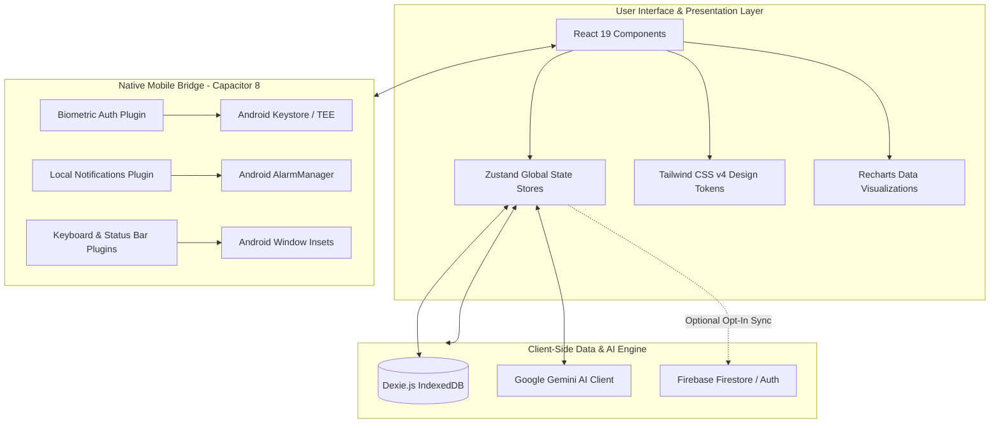

<div align="center">

# FinTrack

**Enterprise-Grade Personal Finance Intelligence & Native Android Asset Management System**

[](https://github.com/Flynarch/finansial-tracker/releases/tag/v4.6.6)
[](https://github.com/Flynarch/finansial-tracker/releases/latest)
[](https://react.dev/)
[](https://vitejs.dev/)
[](https://tailwindcss.com/)
[](https://dexie.org/)
[](https://ai.google.dev/)
[](LICENSE)

*A privacy-first, offline-capable financial operations engine equipped with Google Gemini AI receipt perception, local IndexedDB persistence, bank-grade biometric security, and native Android execution.*

[Download Latest APK (v4.6.6)](https://github.com/Flynarch/finansial-tracker/releases/tag/v4.6.6) • [Documentation](#table-of-contents) • [Architecture](#system-architecture) • [Getting Started](#getting-started)

---

</div>

## Table of Contents

- [Overview](#overview)
- [Design Philosophy & Aesthetic](#design-philosophy--aesthetic)
- [Key Feature Modules](#key-feature-modules)
  - [1. Executive Bento Dashboard & Net Worth Matrix](#1-executive-bento-dashboard--net-worth-matrix)
  - [2. Google Gemini AI Perception Engine](#2-google-gemini-ai-perception-engine)
  - [3. Multi-Wallet & Account Portfolio](#3-multi-wallet--account-portfolio)
  - [4. Dynamic Budgets & Split-Bill Calculator](#4-dynamic-budgets--split-bill-calculator)
  - [5. Savings Vaults & Target Progression](#5-savings-vaults--target-progression)
  - [6. Debt & Loan Manager with Forgiveness Workflow](#6-debt--loan-manager-with-forgiveness-workflow)
  - [7. Financial Discipline Matrix & Habit Heatmap](#7-financial-discipline-matrix--habit-heatmap)
  - [8. Hardware-Secured Privacy Fortress](#8-hardware-secured-privacy-fortress)
- [System Architecture](#system-architecture)
- [Tech Stack & Dependencies](#tech-stack--dependencies)
- [Getting Started](#getting-started)
  - [Prerequisites](#prerequisites)
  - [Installation](#installation)
  - [Environment Configuration](#environment-configuration)
  - [Development Server](#development-server)
  - [Production Build](#production-build)
- [Native Android APK Compilation](#native-android-apk-compilation)
- [Repository Structure](#repository-structure)
- [Data Security & Privacy Principles](#data-security--privacy-principles)
- [License](#license)

---

## Overview

**FinTrack** is an offline-first personal financial management application engineered for mobile and desktop environments. Built with **React 19**, **Dexie.js (IndexedDB)**, and **Capacitor 8**, the application eliminates dependence on centralized backend servers while providing instant responsiveness, cryptographic data protection, and AI-driven workflow automation.

Sensitive financial records—such as bank accounts, transactions, debts, savings vaults, and budget allocations—are stored strictly within local client storage. Optional cloud synchronization via Firebase is governed entirely by user opt-in.

---

## Design Philosophy & Aesthetic

```
+-------------------------------------------------------------------------+
|                           FINTRACK DESIGN SYSTEM                        |
|                                                                         |
|  [ Film Grain Mesh ]  -->  SVG feTurbulence overlay (3% soft-light)     |
|  [ Ambient Glow ]     -->  Vignette-masked aurora radial gradients      |
|  [ Color Palettes ]   -->  Light Luxe / Matte Dark (Slate-700) /        |
|                            Midnight Sapphire (Cyan Glow)                |
|  [ Motion & Touch ]   -->  Spring physics, zero desktop hover traps,   |
|                            Android back-button hardware integration     |
+-------------------------------------------------------------------------+
```

- **Stripe & Linear Inspired Background**: Subtle SVG film grain with radial ambient blooms replaces generic flat patterns and distracting vector meshes.
- **Zero Halo Bleed**: Seamless transparent containers eliminate dark border smudges, clipping artifacts, and floating panel cuts.
- **Three Precision Themes**:
  - **Light Luxe**: Crisp ivory canvas with hairline slate borders and ambient elevations.
  - **Matte Dark**: Deep charcoal slate palette (`#161c28` / `#202736`) with calibrated field contrast.
  - **Midnight Sapphire**: Deep navy canvas (`#0b1120` / `#141f38`) highlighted with electric cyan hairlines.

---

## Key Feature Modules

### 1. Executive Bento Dashboard & Net Worth Matrix
- **Real-Time Net Worth Calculation**: Aggregates cash holdings, bank deposits, e-wallets, investments, and active liabilities into a unified balance indicator.
- **Spring-Animated Balance Masking**: Privacy mode hides balances behind animated dot sequences with staggered spring pop physics.
- **Cashflow Trajectory Analytics**: Interactive area and dual-bar charts powered by Recharts with time horizon filtering (Weekly, Monthly, Yearly).
- **Wallet Carousel**: Swipeable account cards with instant balance visibility toggles and institution logos.
- **Quick-Access Quick-Add Modal**: Unified transaction entry sheet with category picker, date picker, tag manager, and receipt camera scanner.

### 2. Google Gemini AI Perception Engine
- **Multimodal Receipt OCR**: Upload or capture physical paper receipts to automatically extract merchant name, transaction date, line items, and grand total using Google Gemini Vision.
- **Natural Language Quick-Log**: Type plain language prompts (*e.g., "Paid 45k for fuel via Mandiri"*) to instantly populate categorized records.
- **Financial Intelligence Chat**: Conversational AI advisor analyzes historical spending trends, identifies budget leaks, and suggests savings optimizations.
- **Itemized Digital Receipts**: Formatted, shareable digital receipt view with itemized tax, tip, and line-item breakdown.

### 3. Multi-Wallet & Account Portfolio
- **Broad Institution Catalog**: Pre-configured metadata for major banks (BCA, Mandiri, BNI, BRI, CIMB, Jago, Seabank), e-wallets (GoPay, OVO, Dana, ShopeePay), and investment platforms (Bibit, Stockbit, Pluang).
- **Multi-Currency Engine**: Live currency conversion across global currencies (IDR, USD, EUR, SGD, JPY, GBP, etc.) with custom rate overrides.
- **Non-Distortive Internal Transfers**: Direct transfers between user wallets preserve overall net worth without inflating cashflow analytics.

### 4. Dynamic Budgets & Split-Bill Calculator
- **Category Threshold Monitoring**: Set monthly spending limits per category with progress bars and overspending warnings.
- **Overspending Alerts**: Real-time indicators when expenses exceed 80% and 100% of defined budget quotas.
- **Group Split-Bill Utility**: Calculate equal or itemized bill shares among friends, compute individual obligations, and generate formatted summary receipts.

### 5. Savings Vaults & Target Progression
- **Goal-Driven Vaults**: Establish targeted savings funds (*e.g., Emergency Fund, Vacation, Vehicle*) with target deadlines and target amounts.
- **Deposit & Withdrawal Ledgers**: Dedicated transaction history per vault with milestones and completion percentage meters.
- **Runway Estimator**: Computes months of emergency financial runway based on rolling average monthly expenditures.

### 6. Debt & Loan Manager with Forgiveness Workflow
- **Dual-Ledger Tracking**: Distinct records for money lent (*Receivables / Piutang*) and money borrowed (*Liabilities / Hutang*).
- **Installment Amortization**: Log partial payments, calculate remaining balances, and inspect repayment progress.
- **Loan Forgiveness Workflow**: Mark debts as forgiven with visual stamps, dedicated audit dialogs, and localized filters.
- **Due Date Notifications**: Integrated local device alarm reminders before payment deadlines.

### 7. Financial Discipline Matrix & Habit Heatmap
- **GitHub-Style Activity Heatmap**: Visual grid representing daily transaction logging consistency and budgeting discipline.
- **Automated Recurring Scheduler**: Recurring transaction engine for monthly rent, utility bills, subscriptions, and salary disbursements.
- **Financial Action Matrix**: Interactive checklist for tax deadlines, bill payments, and investment rebalancing tasks.

### 8. Hardware-Secured Privacy Fortress
- **Native Biometrics**: Hardware TEE / Keystore backed Fingerprint and Face Unlock powered by `@aparajita/capacitor-biometric-auth`.
- **2-Factor PIN & SVG Pattern Lock**: Customizable keypad PIN and continuous node pattern lock drawer with auto-lock timer when the app is backgrounded.
- **Cryptographic Recovery Phrase**: 12-word mnemonic phrase generator to ensure account recovery without remote central servers.
- **Zero External Telemetry**: No third-party tracking scripts, analytics SDKs, or data harvesting libraries.

---

## System Architecture



---

## Tech Stack & Dependencies

| Category | Technology | Purpose |
| :--- | :--- | :--- |
| **Frontend Framework** | React 19.2.5 | Component lifecycle and virtual DOM rendering |
| **Build Tool** | Vite 8.1.3 | ESM development server and Rollup production bundler |
| **Styling Engine** | Tailwind CSS v4.2.4 | Utility-first CSS variables and design token system |
| **Iconography** | Lucide React | Clean, scalable SVG icons |
| **State Management** | Zustand 5.0.13 | Lightweight, unopinionated reactive store slices |
| **Local Storage** | Dexie.js 4.4.2 | IndexedDB wrapper for reactive offline transactions |
| **Mobile Runtime** | Capacitor 8.4.1 | Native Android container and hardware plugin bridge |
| **Biometric Security** | @aparajita/capacitor-biometric-auth | Native Android fingerprint and biometric verification |
| **Artificial Intelligence** | Google Gemini Generative AI | Multimodal receipt OCR and financial NLP |
| **Charts & Analytics** | Recharts 3.9.2 | Responsive SVG data visualization |
| **Date Manipulation** | date-fns 4.1.0 | Immutable date math and formatting |
| **Cloud (Optional)** | Firebase 12.13.0 | Optional authenticated cloud backup and restore |

---

## Getting Started

### Prerequisites
- **Node.js**: `v18.x` or higher (`v20.x` LTS recommended)
- **Package Manager**: `npm` (v9+)
- **Android SDK / Android Studio** (required only for building the native `.apk`)
- **Java JDK**: Version 17 or 21 (for Gradle compilation)

### Installation

1. Clone the repository:
   ```bash
   git clone https://github.com/Flynarch/finansial-tracker.git
   cd finansial-tracker
   ```

2. Install dependencies:
   ```bash
   npm install
   ```

### Environment Configuration

Create a `.env` file in the project root with the following keys:

```env
# Google Gemini AI Perception Engine
VITE_GEMINI_API_KEY=your_gemini_api_key

# Optional Firebase Cloud Synchronization
VITE_FIREBASE_API_KEY=your_firebase_api_key
VITE_FIREBASE_AUTH_DOMAIN=your_project.firebaseapp.com
VITE_FIREBASE_PROJECT_ID=your_project_id
VITE_FIREBASE_STORAGE_BUCKET=your_project.appspot.com
VITE_FIREBASE_MESSAGING_SENDER_ID=your_sender_id
VITE_FIREBASE_APP_ID=your_app_id
```

### Development Server

Start the local Vite development server:

```bash
npm run dev
```

The application will be accessible at `http://localhost:5173`.

### Production Build

To compile and bundle optimized static web assets:

```bash
npm run build
```

Production artifacts will be generated in the `dist/` directory.

---

## Native Android APK Compilation

FinTrack compiles directly into a native Android APK via Capacitor and Gradle.

### 1. Build and Sync
```bash
# Build the production bundle
npm run build

# Sync web assets and plugins to Android native project
npx cap sync android
```

### 2. Assemble Debug APK
```bash
# On Windows
cmd.exe /c "cd android && gradlew.bat assembleDebug"

# On Linux / macOS
cd android && ./gradlew assembleDebug
```

The compiled APK will be located at `android/app/build/outputs/apk/debug/app-debug.apk`.

---

## Repository Structure

```
finansial-tracker/
├── .agents/                  # AI agent guidelines, protocols, and domain skills
├── android/                  # Native Android Capacitor wrapper and Gradle scripts
├── public/                   # Static assets, SVG icons, manifests
├── src/
│   ├── components/           # Atomic and modular UI components
│   │   ├── board/            # Interactive visual canvas and nodes
│   │   ├── budget/           # Budget management sheets and split-bill modals
│   │   ├── chat/             # Gemini AI assistant and receipt OCR UI
│   │   ├── currency/         # Multi-currency exchange rate converter
│   │   ├── dashboard/        # Bento widgets, net worth charts, wallet carousel
│   │   ├── habits/           # Heatmap and financial discipline tracker
│   │   ├── layout/           # AppShell, AppBackground, BottomNav, PageHeader
│   │   ├── loans/            # Loan amortization and forgiveness dialogs
│   │   ├── onboarding/       # Interactive walkthrough and setup flows
│   │   ├── reports/          # Financial report charts and breakdown cards
│   │   ├── savings/          # Savings vaults, progress meters, and goal sheets
│   │   ├── settings/         # Theme toggles, security locks, currency, backup
│   │   ├── todo/             # Financial to-do checklist and deadlines
│   │   ├── transactions/     # Transaction sheets, quick-add modal, filters
│   │   └── ui/               # Reusable primitives (Modal, Sheet, LockScreen)
│   ├── data/                 # Institution catalogs and category dictionaries
│   ├── hooks/                # Custom hooks (Translation, BackButton, Swipe)
│   ├── lib/                  # Dexie database, Gemini AI, Biometrics, i18n
│   ├── pages/                # Route view components (Dashboard, Transactions, etc.)
│   ├── store/                # Zustand global state slices
│   ├── App.jsx               # Root application router and layout providers
│   ├── index.css             # Tailwind CSS tokens and design system rules
│   └── main.jsx              # Application entry point
├── capacitor.config.json     # Capacitor native Android configuration
├── package.json              # Project manifest and scripts
└── vite.config.js            # Vite bundler and plugin configuration
```

---

## Data Security & Privacy Principles

1. **Client-Side Sovereign Storage**: All database writes target the browser's local IndexedDB instance. No financial details are transmitted to remote servers during standard operation.
2. **Zero Third-Party Telemetry**: The codebase contains no advertising SDKs, tracking pixels, or third-party behavioral telemetry.
3. **Hardware Biometric Validation**: Biometric unlock requests interface directly with the device's hardware security module (Android Keystore / TEE) via Capacitor.
4. **Transparent Data Portability**: Users can export full database snapshots in standard JSON format or restore existing backups at any time.

---

## License

This project is licensed under the MIT License. See the [LICENSE](LICENSE) file for details.

<div align="center">

---

<sub>Engineered for financial privacy, performance, and precision.</sub>

</div>
